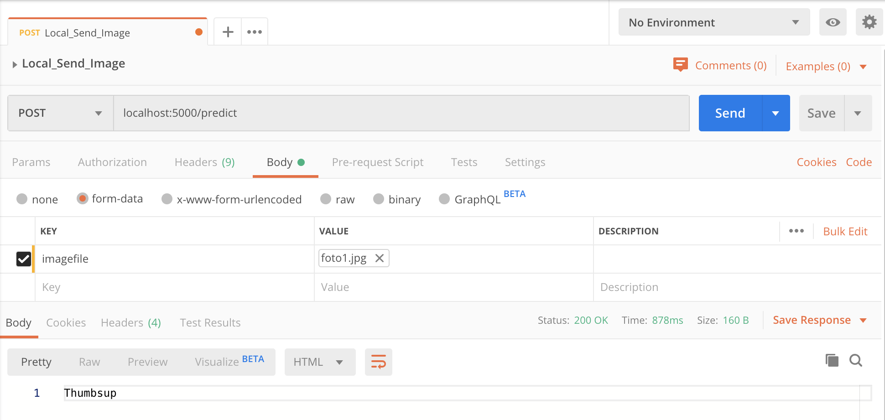

# FlaskApp_SemanticVoidMachine
This project is a Flask App that loads Keras models to both predict and classify values from the void machine we're working on

## Installation
1. Pull the code
2. Create a Python environment and activate it

*e.g.* 
`virtualenv -p python3 .venv`
`source .venv/bin/activate`

3. Install requirements

*e.g.*
`pip install -r requirements.txt`

4. Run the server

*e.g.*
`python server.py`

The server accepts an image via **POST**, adding the image as form-data with the key *imagefile*
*e.g.*

## Done
- The models predicts the on/off state (classification) of the engine button

## TODO
- Training and loading the model to read void value needle (regression)
